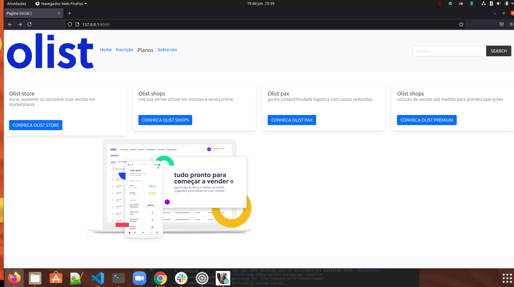
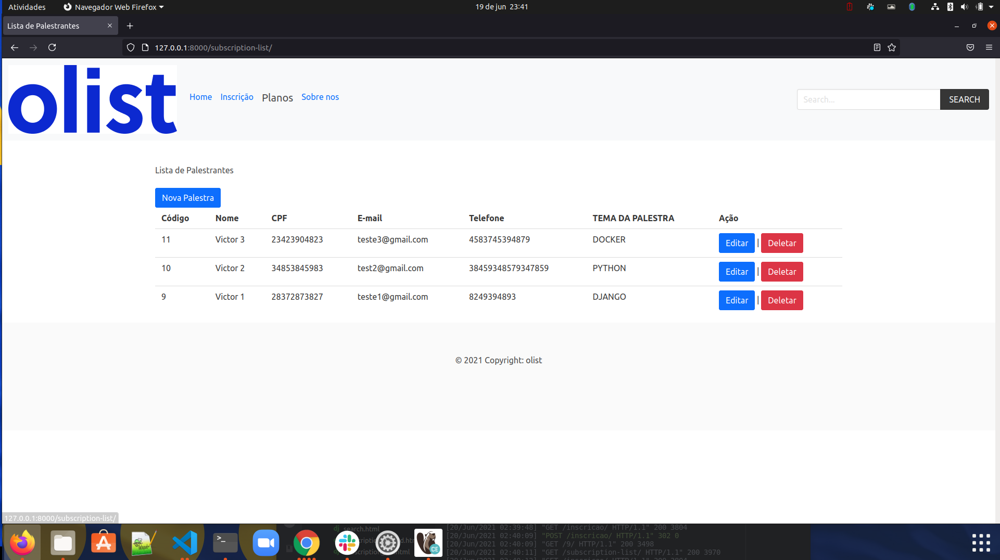
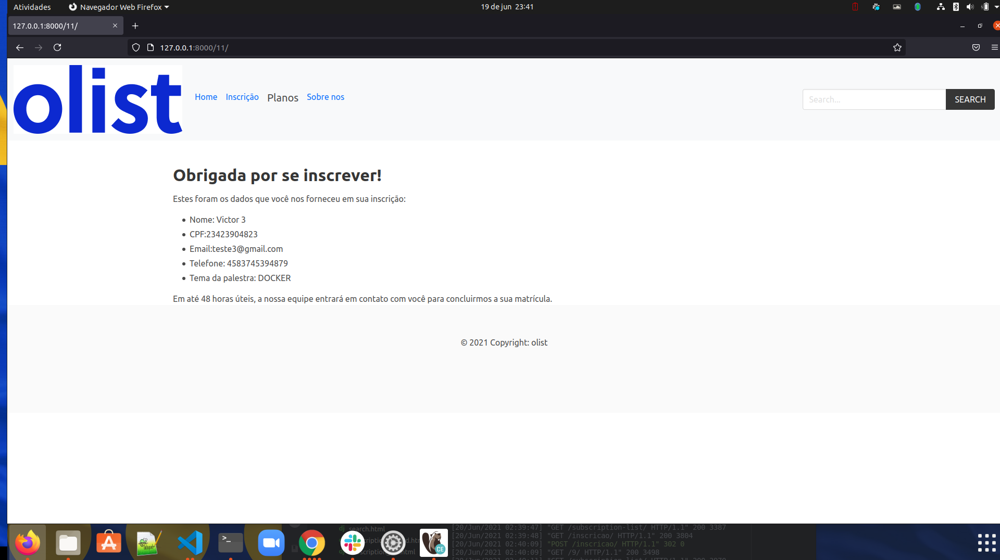

# Lecture-list

Sistema palestra Tech-start

## Como Desenvolver ? 

1. Clone o repositório
2. Crie um ambiente virtual com poetry com python 3.9
3. Ative o ambiente 
4. Instale as depedencias
5. Configure a instancia com o .env
6. Execute os testes.

```console
git clone git@github.com:VictorOliveiraPy/ts-app-1806.git
cd repository
poetry shell
poetry install
python manage.py test
```

# Docker postgreSQL

```console
docker run -d --name nome -e POSTGRES_PASSWORD=senha -e POSTGRES_USER=user -p 5432:5432 postgres'
```
# Pagina inicial


# Tela de sucesso 


# List


